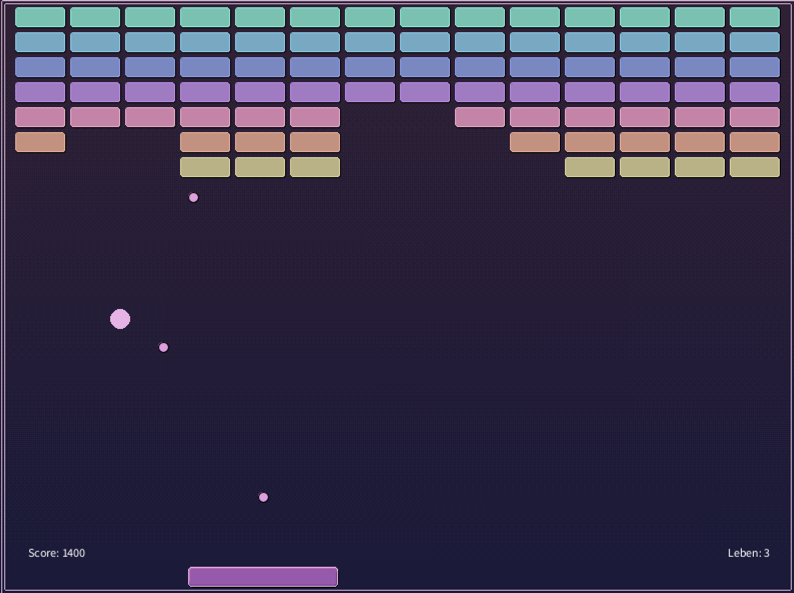
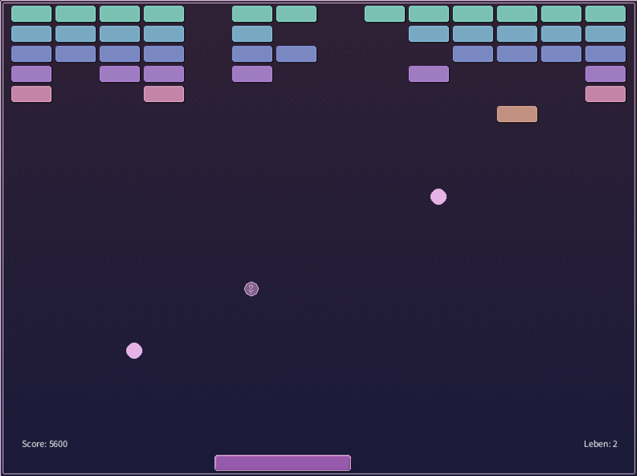

# Mein Projekt: Breakout

Autor: Nico De Luca, 5285671

## Kurzbeschreibung

Mein Spiel ist eine Version des Atari-Klassikers Breakout. 
Man steuert als Spieler einen Pong-ähnlichen Schläger und muss mit diesem, Bälle gegen Blöcke lenken. 
Die Bälle prallen in bestimmten Winkeln vom Schläger ab, sodass man Einfluss darauf haben kann, wohin der Ball als nächstes fliegt. 
Der Schläger wird mit der Taste A nach links und mit D nach rechts gelenkt. 
Blöcke können, wenn sie vom Ball zerstört werden, mit einer Wahrscheinlichkeit von 20% ein Item fallen lassen. 
Dieses hat einen von drei zufälligen Effekten. 
Es kann entweder den Spieler vergrößern, einen weiteren Ball hinzufügen oder 10 Schüsse senkrecht nach oben schießen, ausgehend vom Spieler. 
Ziel ist es, alle Blöcke zu zerstören und damit zu gewinnen. 
Wenn man gewinnt, kann man neu anfangen und so versuchen, einen möglichst hohen Highscore zu erreichen.

## Quellen

[ASCII Key Werte](https://www.ascii-code.com/)

[Kollisionsabfrage der Seiten der Blöcke](https://gamedev.stackexchange.com/questions/22609/breakout-collision-detecting-the-side-of-collision)

[Problem mit dem Abprall verhalten eines Balles an einem Block](https://www.spieleprogrammierer.de/15-2d-und-3d-grafik/18831-problem-mit-dem-abprallverhalten-eines-balles-an-einem-block/
)

[Abprall Winkel berechnen](https://stackoverflow.com/questions/573084/how-to-calculate-bounce-angle
)

[Problem mit Tunneling von Ball in Block](https://gamedev.stackexchange.com/questions/95817/breakout-collision-detection-ball-gets-trapped-inside-block
)

[Processing Dokumentation](https://processing.org/reference/#math)

Grafiken: Kai De Luca

## Screenshots

###### Screenshot 1: Startbildschirm mit Erklärung wie das Spiel zu steuern ist.


###### Screenshot 2: Der Screenshot zeigt wie es aussieht wenn man im Spiel ist und auch eins der Items aktiv ist.


###### Screenshot 3: Hier sieht man wie der Spieler mehrere Bälle auf dem Spielfeld hat und ein Item gerade zum einsammeln runter fällt.



## Notwendige Schritte um das Spiel zu starten

Die Main Methode in der Main Klasse starten. Der Rest wird im Spiel erklärt. (siehe Screenshot 1)

## JShell Beispiel.
Das unten gezeigte Beispiel zeigt,
wie sich nach der Verwendung meines ersten Items, 
welches die Weite des Spielers verlängern soll, 
genau das auch in der Jshell bei verwendung passiert.
```
Code 

jshell> import Model.MyModel

jshell> var Model = new MyModel()

jshell> model.getPlayerWidth()
$3 ==> 150.0

jshell> model.item1()

jshell> model.getPlayerWidth()
$5 ==> 160.0

```
